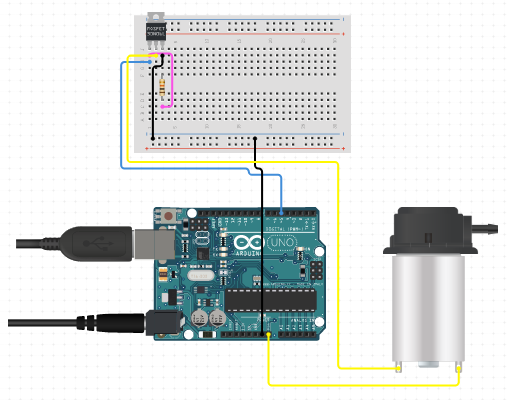

# Azotobacter C water pump
Software part of Egyptian STEM schools capstone project "Azotobacter C"
## Arduino Circut

## The C in the name
It stands for both "chroococcum" in the name of the Azotobacter bacteria and for the programming language C/C++ which the software is written in for the Arduino
## More info
If you are interested in this project you can know more on ResearchGate [comming soon](#ResearchGate)
